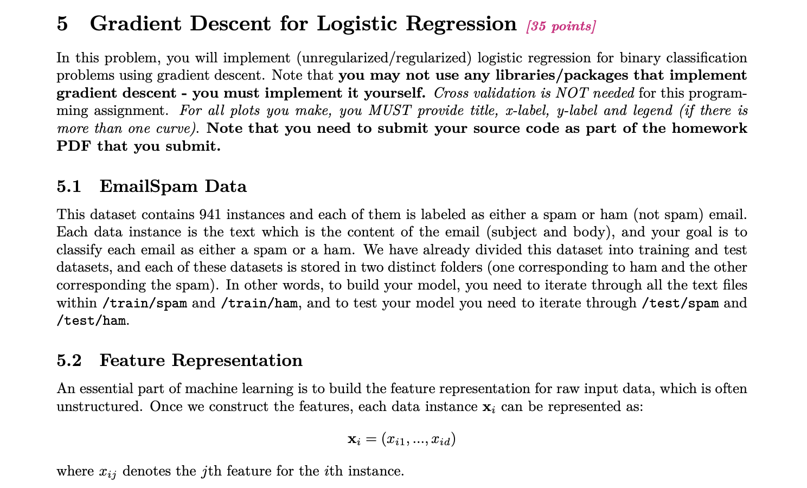
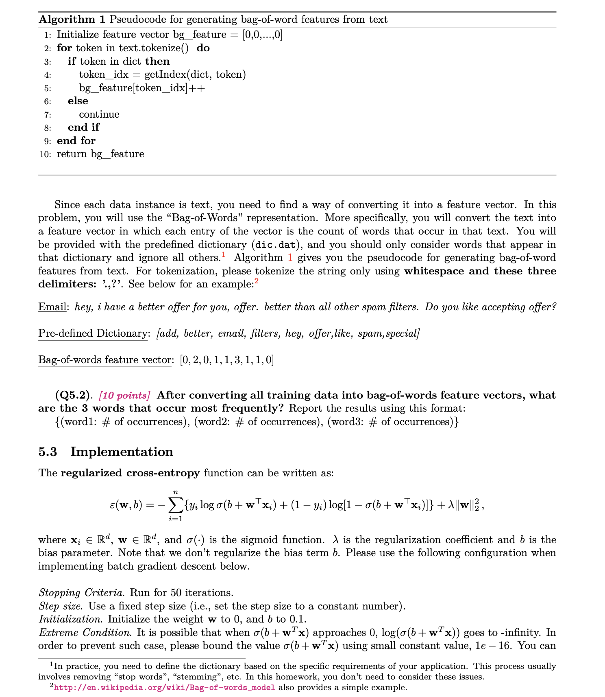
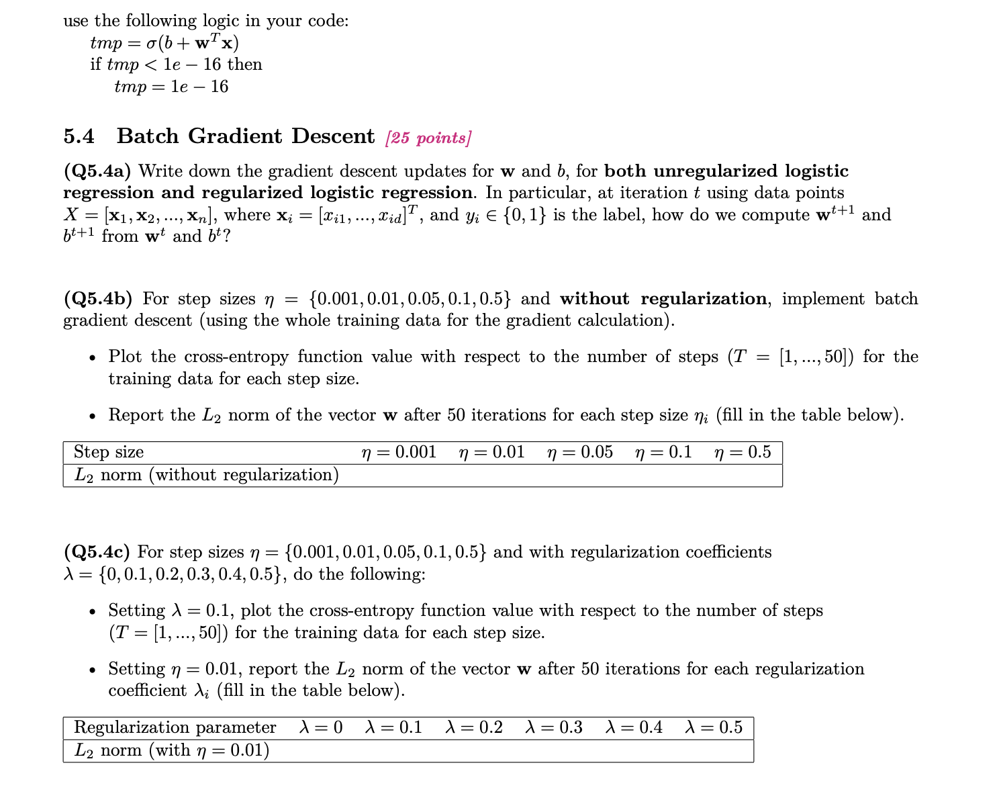
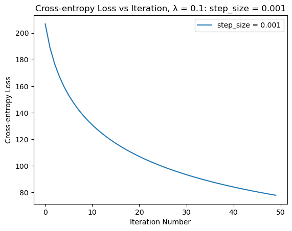
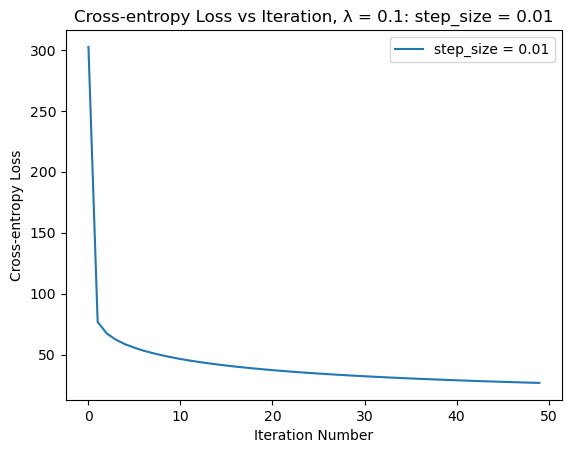
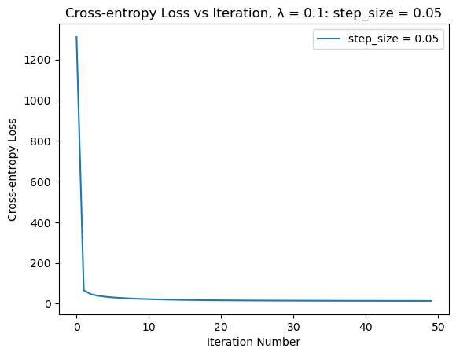
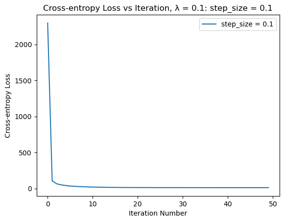
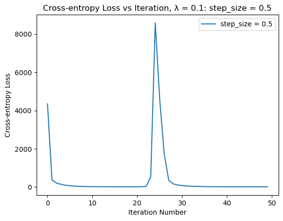
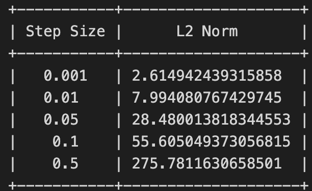

# Gradient-Descend-for-Logistic-Regression
Gradient Descend for Logistic Regression
# Specs

# Results
# Cross Entropy Loss vs Iteration: Learning rate = 0.1, step size = 0.001

# Cross Entropy Loss vs Iteration: Learning rate = 0.1, step size = 0.01

# Cross Entropy Loss vs Iteration: Learning rate = 0.1, step size = 0.05

# Cross Entropy Loss vs Iteration: Learning rate = 0.1, step size = 0.1

# Cross Entropy Loss vs Iteration: Learning rate = 0.1, step size = 0.5

# L2 norm vs Step size

